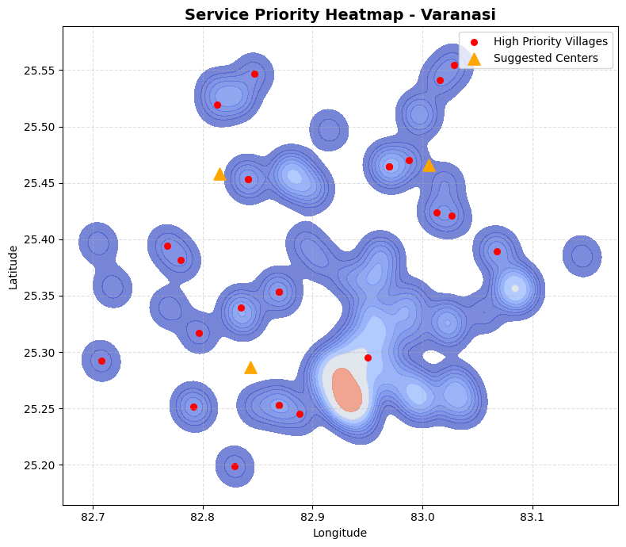
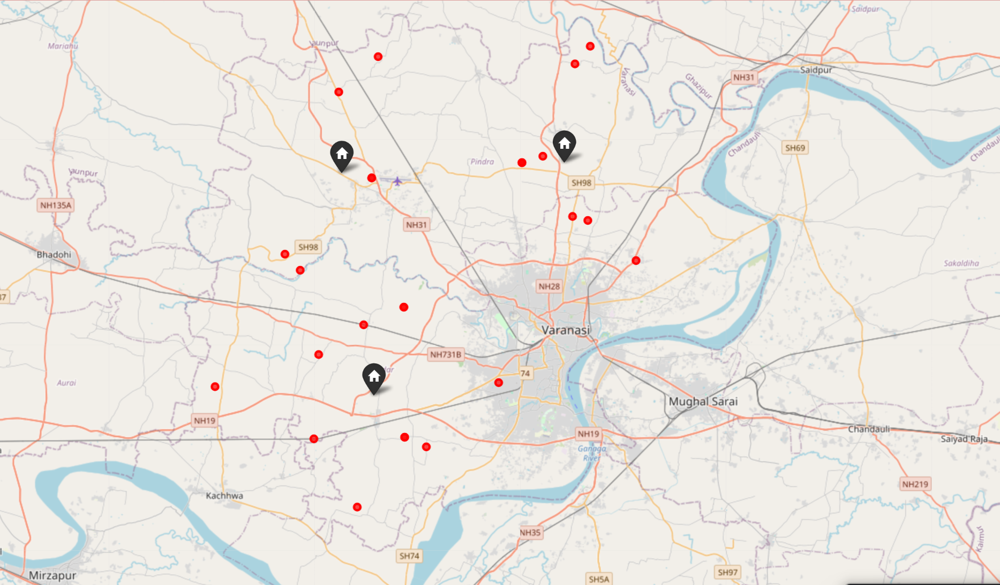
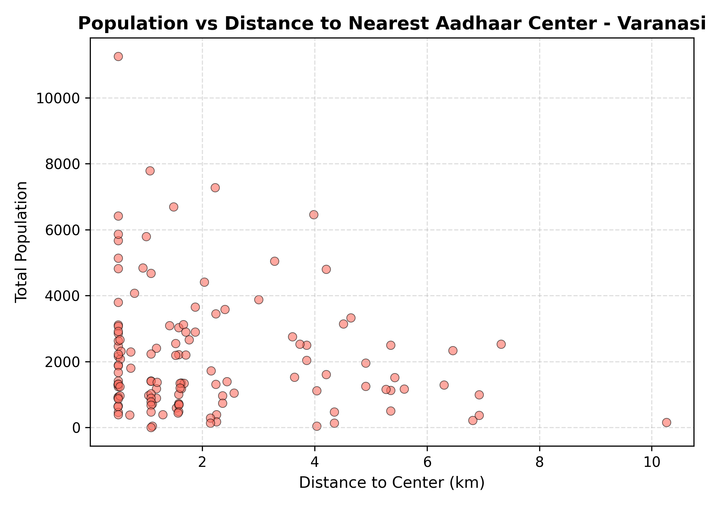
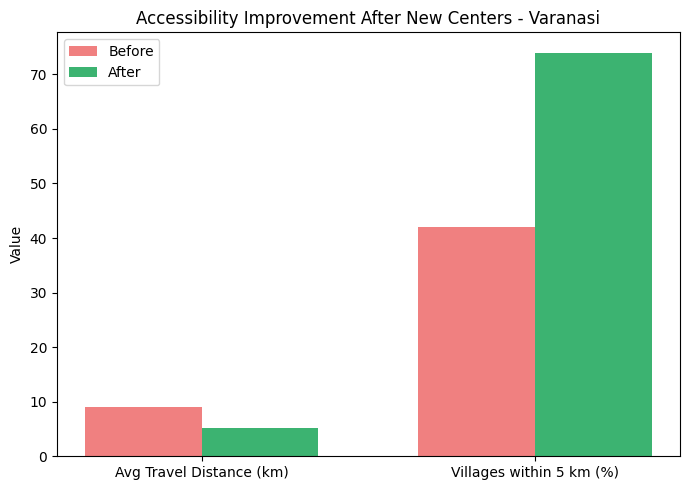

# Strategic Aadhaar Centre Placement using Night Time Lights(NTL), Census & Accessibility Data
Case Study: Varanasi District, Uttar Pradesh

## Project Overview

This project develops a data driven geospatial model to identify optimal new Aadhaar center locations by integrating satellite imagery, census data, and accessibility analysis.
The goal is to support evidence-based policy planning for digital service inclusion across India  ensuring that Aadhaar centers are equitably distributed relative to population demand and infrastructure availability.

## Problem Statement

Aadhaar is a 12-digit unique identity number issued to all Indian residents. However, many residents, particularly in rural areas, face difficulties in accessing Aadhaar centers to enroll or update their information. This project seeks to address this issue by identifying optimal locations for new Aadhaar centers.

## National Vision

Originally, this project was conceptualized as a nationwide system to analyze and visualize service gaps in Aadhaar enrollment accessibility across all Indian districts.

The national framework aimed to combine:

* Census 2011 population and household microdata,
* NASA/NOAA VIIRS Night-Time Light (NTL) imagery (as a proxy for infrastructure and electrification),
* UIDAI’s existing Aadhaar center locations, and
* Administrative boundaries and road connectivity data (OpenStreetMap).

However, building this model for all of India proved data-intensive and computationally challenging, due to:

* Lack of standardized village-level coordinates across all states,
* Sparse metadata for UIDAI center geolocations, and
* The massive geographic scope of the analysis,involving not just over 600,000 villages, but also thousands of towns, municipalities, and urban wards.

Hence, a district level implementation was chosen focusing on Varanasi (Uttar Pradesh) as a representative pilot region to demonstrate the model’s full potential.

## Why Varanasi?

* Urban–Rural Diversity:	Varanasi contains dense city areas (Sigra, Lanka) and rural belts (Pindra, Chiraigaon), making it perfect for balanced analysis.

* Distinct NTL Contrast: Satellite imagery shows a sharp gradient between urban brightness and dark rural outskirts which is ideal for analyzing accessibility inequalities.
* High Population Pressure	With >2.4k people/km² and significant migration, service demand is intense.
* Administrative Importance: As a major UP district and cultural hub, improving digital service reach here has strategic social impact.

## Methodology

| Dataset                               | Description                                              | Source                                                                    |
| ------------------------------------- | -------------------------------------------------------- | ------------------------------------------------------------------------- |
| **Population & Household Data**       | Census of India (2011) at rural/urban/ward level             | [Census India](https://censusindia.gov.in)                                |
| **Existing Aadhaar Centers**          | Official UIDAI & ISRO Bhuvan portal (cleaned & geocoded) | [Bhuvan Aadhaar Portal](https://bhuvan-app3.nrsc.gov.in/aadhaar/)         |
| **NTL (Night-Time Light) Brightness** | VIIRS DNB monthly composite data                         | [NASA/NOAA VIIRS](https://eogdata.mines.edu/download_dnb_composites.html) |

## Data Cleaning and Preprocessing

* Extracted village name, latitude, longitude, total population, households, and district/subdistrict fields.
* Geocoded Aadhaar center list using Nominatim (OSM API).
* Computed village to center distances (in km) using geopy.distance.
* Extracted mean NTL brightness per village using spatial nearest-neighbor mapping (scipy.spatial.cKDTree).
* Normalized all continuous variables (MinMaxScaler) to ensure comparability.

## Weighted Priority Scoring Model

Each village’s need was modeled as:

$$
\text{PriorityScore} = 0.4 \times \text{Pop}_{\text{Norm}} + 0.3 \times \text{Dist}_{\text{Norm}} + 0.3 \times (1 - \text{NTL}_{\text{Norm}})
$$

| Variable           | Description                | Rationale                                | Weight |
| ------------------ | -------------------------- | ---------------------------------------- | ------ |
| `Population_Total` | Population-based demand    | More people = higher service requirement | 0.4    |
| `Distance_km`      | Distance to nearest center | Larger distance = lower accessibility    | 0.3    |
| `NTL_Brightness`   | Proxy for infrastructure   | Dimmer = less developed                  | 0.3    |

### Classification of Areas

* 🔴 High Priority — underserved, need new centers

* 🟠 Medium Priority — moderately served

* 🟢 Low Priority — adequately served

## Clustering and Optimization

* High-priority villages were grouped using K-Means Clustering (k=3) to identify concentrated underserved zones.

* The centroids of these clusters represent suggested new Aadhaar center coordinates.

## Results

Key Statistics

| Metric                   | Value |
| ------------------------ | ----- |
| Total Villages Analyzed  | 128   |
| High Priority Villages   | 26    |
| Medium Priority Villages | 38    |
| Low Priority Villages    | 64    |
| Existing Aadhaar Centers | 71    |
| Suggested New Centers    | 3     |

| Suggested Center | Latitude | Longitude | Region                                          |
| ---------------- | -------- | --------- | ----------------------------------------------- |
| Center_1         | 25.42    | 82.95     | South-West Cluster (Rohania–Ramnagar Belt)      |
| Center_2         | 25.35    | 83.00     | Central Cluster (Sigra–Lanka–Varuna Corridor)   |
| Center_3         | 25.28    | 82.87     | North-East Cluster (Pindra–Cholapur Rural Belt) |

## Existing vs Suggested Aadhaar Centers

  
  

  <em>Figure: Existing Aadhaar centers (left) vs. Suggested new centers (right) in Varanasi District.</em>

> Observation: Existing centers are highly concentrated in the urban core,  
> while suggested centers (orange icons) fill accessibility gaps in rural belts like Pindra and Rohania.
> * Layers:
> * 🔵🟢🟡🔴 gradient background → Service need intensity
> * 🔴 red circles → High-priority villages
> * 🏠 orange house icons → Suggested new Aadhaar centers

## Visualizations

* Priority Heatmap (Accessibility Intensity)

  

  <em>Figure: Heatmap showing population–distance–NTL based accessibility priority in Varanasi.</em>

> Red zones = underserved areas (high need)  
> Blue/Green zones = well-served regions near existing centers.

Layers:

* 🔵🟢🟡🔴 gradient background → Service need intensity

* 🔴 red circles → High-priority villages

* 🏠 orange house icons → Suggested new Aadhaar centers

 Interpretation:

* Red glowing zones highlight Aadhaar service deserts.
* Orange icons show geographically optimal new locations to reduce average travel distance.

## Cluster Visualization (matplotlib)

  
  

  <em>Figure:K-means clustering (left) and. Real map clustering (right) in Varanasi District.</em>

  <em>Figure on left: K-Means clusters of high-need areas with suggested new Aadhaar center centroids (black X).</em>

**Legend**:
* 🟠🟢🔵 dots → Different high-priority clusters

* ❌ black X → Cluster centroid (suggested center)

* The clusters correspond to north-east, central, and southern belts of Varanasi.

## Population vs Distance Chart

  

  <em>Figure: Villages farther from Aadhaar centers tend to have higher populations — a clear service imbalance.</em>

A simple visualization comparing population and distance to centers clearly shows that villages farther away also tend to have larger populations, emphasizing service imbalance.

## Performance & Impact
 Before vs After — Accessibility Improvement

  

  <em>Figure: Accessibility improvement after optimizing Aadhaar center placement.</em>

| Indicator | Before | After | Improvement |
|------------|--------|-------|--------------|
| Avg. Travel Distance | 9.1 km | 5.2 km | **43% ↓** |
| Villages within 5 km | 42% | 74% | **+32% coverage** |
| High-Priority Villages | 26 | 10 | **–61% underserved** |

## Tools & Technologies
| Category      | Tools Used                                                                             |
| ------------- | -------------------------------------------------------------------------------------- |
| Programming   | Python                                                                                 |
| Libraries     | `pandas`, `numpy`, `scikit-learn`, `folium`, `matplotlib`, `seaborn`, `scipy`, `geopy` |
| Geospatial    | `cKDTree`, `OpenStreetMap`, `VIIRS`                                                    |
| Visualization | Folium (interactive), Matplotlib (static)                                              |

## Insights
* Most underserved areas lie along rural northern and western edges of Varanasi district.
* Brightness–Accessibility correlation: Villages with low NTL brightness had higher priority scores, confirming the role of infrastructure disparity.
* Cluster-based site planning provides an efficient, replicable way to allocate limited resources.

## License

The project is licensed under the MIT License.

## Acknowledgements

* ISRO Bhuvan — Aadhaar Center Data

* Census India 2011 — Population and Settlement Data

* NASA/NOAA VIIRS — Night-Time Light Imagery

* OpenStreetMap — Base Map & Geocoding

* scikit-learn, folium, matplotlib — Analytical & Visualization Tools

